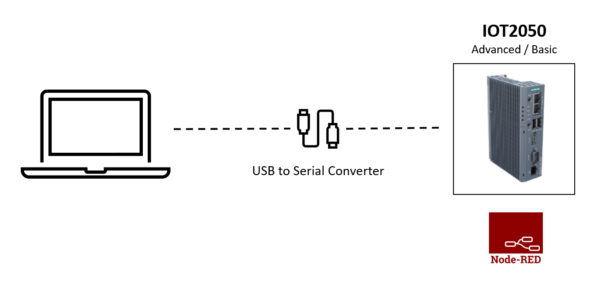

# **IOT2050-Example-Serial-Modbus-Connection**

- [**IOT2050-Example-Serial-Modbus-Connection**](#iot2050-example-serial-modbus-connection)
  - [**Overview**](#overview)
  - [**Hardware**](#hardware)
  - [**Software**](#software)
  - [**Prepare the IOT2050 & Examples**](#prepare-the-iot2050--examples)
  - [**Related Links**](#related-links)
  - [**Contribution and Contribution License Agreement**](#contribution-and-contribution-license-agreement)
  - [**License and Legal Information**](#license-and-legal-information)

## **Overview**

This application shows two ways to exchange data via a serial port between PC (Windows/Linux) and the IOT2050. In the first example a pure serial transmission is used, while in the second example the communication protocol Modbus RTU is used additionally.

## **Hardware**

The following hardware components are required for the application:

- **SIMATIC IOT2050 Advanced or Basic**
- **USB to Serial Converter** (in this example: DIGITUS USB 2.0 to serial Converter, RS485 incl. USB A Cable 80cm)##

## **Software**

- **Example 1: Virtual Machine with Linux OS on Windows PC:** In this example VMWare Workstation 16 Player and Linux Debian 10 is used
  - working internet connection on the VM
  - install **picocom** with the terminal-command 'sudo apt-get install picocom' (in this manual version 3.1 is used)
- **Example 2: PyModSlave on Windows PC:** You can download it [here](https://pypi.org/project/pyModSlave/) (in this manual version 0.4.4 is used)

## **Prepare the IOT2050 & Examples**

You can find the instructions for preparing the IOT2050 and the both examples in the following links:

- [**Prepare the IOT2050**](docs/README-Prepare-the-IOT2050.md)
- [**Example 1: Sending ASCII-characters using a serial connection**](docs/README-Example-1.md)
- [**Example 2: Sending array-packages using modbus-protocol**](docs/README-Example-2.md)

## **Related Links**

||Topic|
|-|-|
|1|SIMATIC IOT2050 forum: [https://support.industry.siemens.com/tf/ww/en/threads/309](https://support.industry.siemens.com/tf/ww/en/threads/309)|
|2|SIMATIC IOT2050 Getting Started: [https://support.industry.siemens.com/tf/ww/en/posts/238945/](https://support.industry.siemens.com/tf/ww/en/posts/238945/)|
|3|Operating Instructions: [https://support.industry.siemens.com/cs/ww/en/view/109779016](https://support.industry.siemens.com/cs/ww/en/view/109779016)|

## **Contribution and Contribution License Agreement**

Thanks for your interest in contributing. Anybody is free to report bugs, unclear documenation, and other problems regarding this repository in the Issues section or, even better, is free to propose any changes to this repository using Merge Requests. For more information please check the [Contribution License Agreement](docs/Siemens_CLA.pdf).

## **License and Legal Information**

Please read the [Legal information](LICENSE.md).
