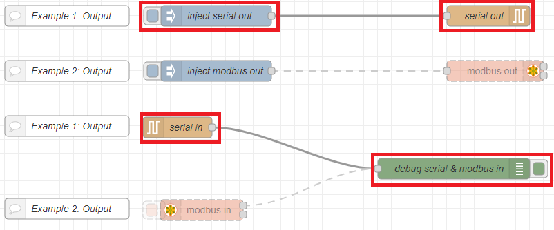
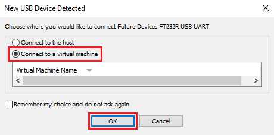
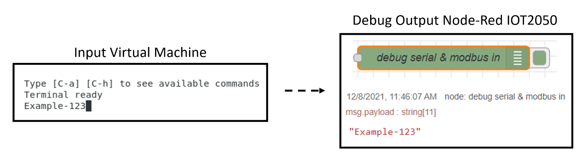
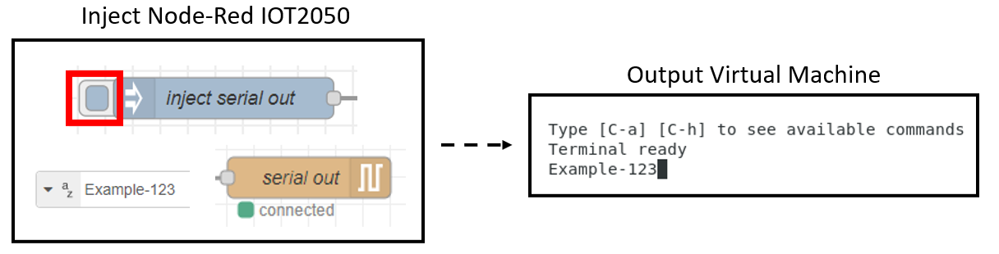

# **Example 1: Sending ASCII-characters using a serial connection**

Make sure the following nodes are activated in Node-Red (the modbus-nodes must be deactivated):

You can enable/disable nodes as follows: Double-Click on the node -> Change Enabled / Disabled -> Click Done -> Press Deploy to apply the changes

Open the Virtual Machine on your PC connected to the IOT2050. If not already done, open a terminal and install picocom (in this manual version 3.1 is used) with the following command:

    sudo apt-get install picocom

With the following command you can then check if the installation was successful:

    which picocom

The terminal should show the output on the image:

Remove the USB to serial converter from your PC and plug it in again. Make sure that the USB device now connects to the virtual machine. The following message appears in VMWare Workstation 16 Player:

Start picocom with the following command:

    sudo picocom /dev/ttyUSB0 -c -b 115200

## **Sending from Virtual Machine to IOT2050**

Once picocom is ready, characters can be entered and then transmitted. The split input timeout is set to 2000ms by default. The output can then be viewed in Node-Red under "debug messages".

## **Sending from IOT2050 to Virtual Machine**

Make sure that picocom is enabled so that a signal can be received. Then, in node-red, the output can be triggered by clicking on the inject-node. The text "Example-123" is configured in the inject-node by default.

You can exit the picocom-command by pressing CTRL+A and CTRL+Q.

## **Other documents**

- [**Application-Overview**](../README.md)
- [**Prepare the IOT2050**](README-Prepare-the-IOT2050.md)
- [**Example 2: Sending array-packages using modbus-protocol**](README-Example-2.md)
