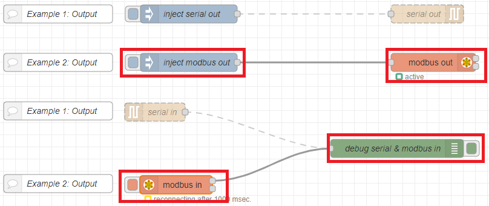
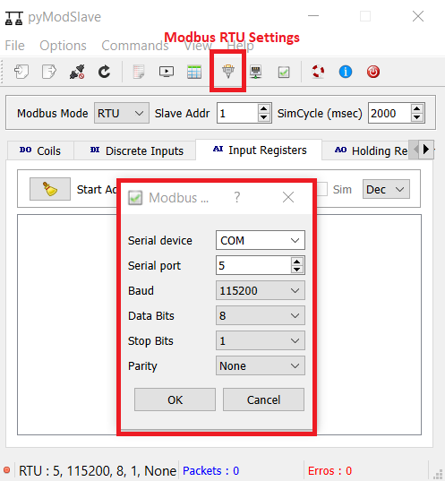
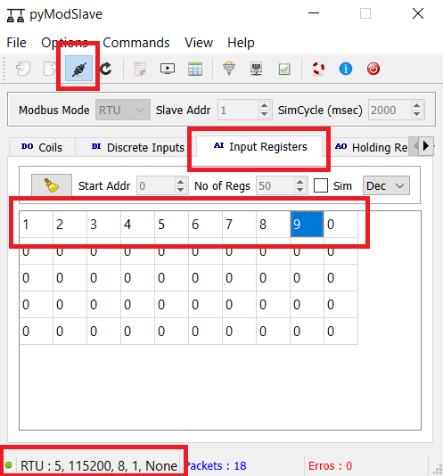
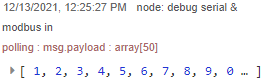
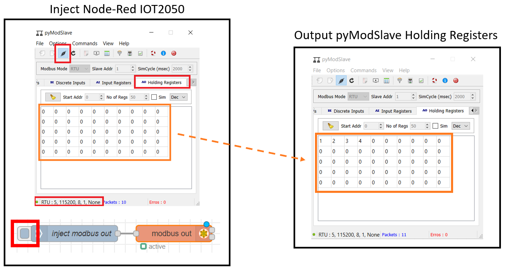

# **Example 2: Sending array-packages using modbus-protocol**

At the beginning, please make sure that the USB to Serial converter is connected directly to your PC and not passed through to a VM (especially if [**Example 1**](README_Example_1) was done before).

If not already done install PyModSlave on your Windows PC: You can download it [here](https://pypi.org/project/pyModSlave/) (in this manual version 0.4.4 is used).

Make sure the following nodes are activated in Node-Red (the serial-in/out-nodes must be deactivated):

You can enable/disable nodes as follows: Double-Click on the node -> Change Enabled / Disabled -> Click Done -> Press Deploy to apply the changes

## **Sending from PC to IOT2050**

Open the application pyModSlave -> Click the "Modbus RTU" settings-button -> Adjust the settings as in the following picture -> Press "OK"

Now switch to the "Input Registers" tab -> Click the "Connect"-button -> The connection should now be displayed as active (green circle at the bottom left) -> The numerical values of the sending array can now be adjusted as desired

The modbus-in node in Node-Red should now receive this array and output it via the debug node:

The transmission can be terminated by clicking the connect-button again.

## **Sending from IOT2050 to PC**

Open the application pyModSlave -> Click the "Modbus RTU" settings-button -> Adjust the settings as in the following picture -> Press "OK"

Now switch to the "Holding Registers" tab -> Click the "Connect"-button -> The connection should now be displayed as active (green circle at the bottom left) -> Then, in node-red, the output can be triggered by clicking on the inject-node. The array "[1,2,3,4" is configured in the inject-node by default. -> In pyModSlave you can now see how the first registers has adapted

## **Other documents**

- [**Application-Overview**](../README.md)
- [**Prepare the IOT2050**](README-Prepare-the-IOT2050.md)
- [**Example 1: Sending ASCII-characters using a serial connection**](README-Example-1.md)
