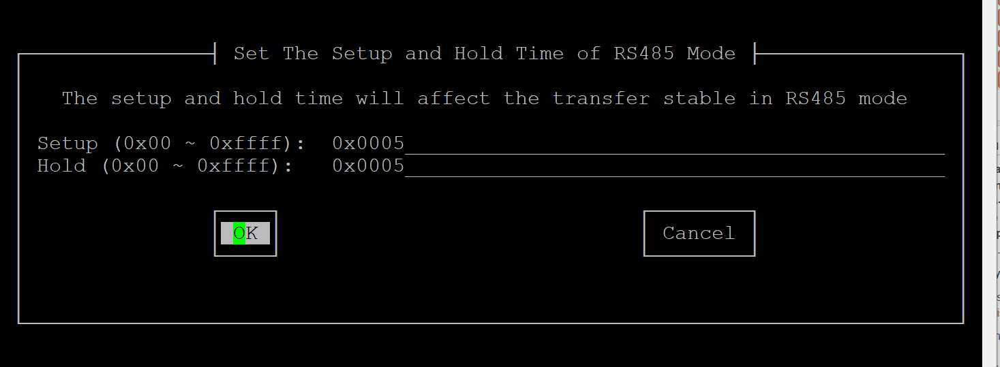
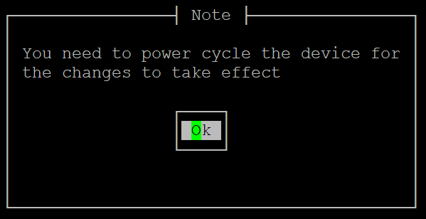
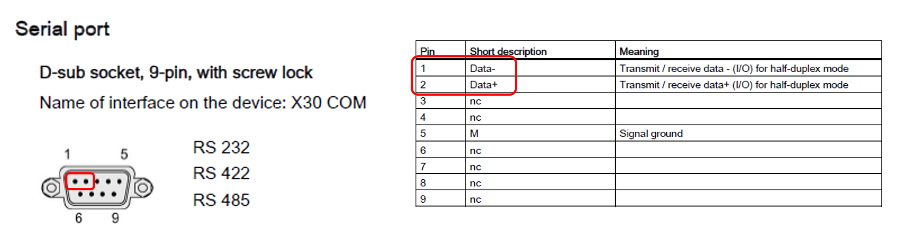
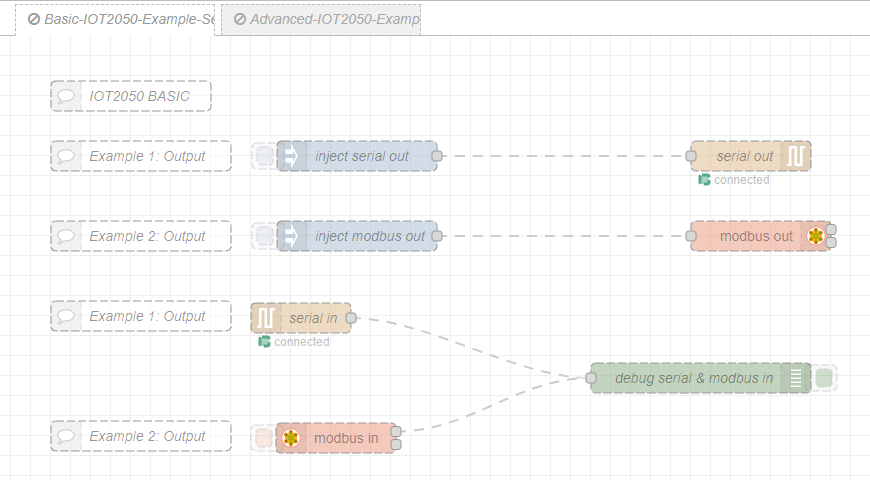

# **Prepare the IOT2050**

## **Installing Example-Image & First commissioning**

Follow [SIMATIC_IOT2050_Setting_up.md](https://github.com/SIMATICmeetsLinux/IOT2050-SmartFarming-Application/blob/main/docs/SIMATIC_IOT2050_setting_up.md) for the following steps:

- Installing the SD-Card Example Image (in this example the image V1.1.1 was used)
- First commissioning of the SIMATIC IOT2050: Remote access with Putty SSH Connection (login as root)
- Network connection to open Node-Red

## **Adjust Peripherals on IOT2050 Basic**

Use the following command to get into the setup:

    iot2050setup

Perform the following steps:

    Peripherals -> Configure External COM Ports -> RS485 -> Select "Turn on terminate resistor" (spacebar) -> Confirm with "Ok" -> Confirm the Changes -> Exit setup-menu and reboot the IOT2050

## **Adjust Peripherals on IOT2050 Advanced**

Use the following command to get into the setup:

    iot2050setup

Perform the following steps:

    Peripherals -> Configure External COM Ports -> RS485 -> Select "Turn on terminate resistor" (spacebar) -> Confirm with "Ok"

The setup- and hold-values must be adjusted as follows (0x0005):

    Confirm with "Ok" -> Cornfim again with "Ok"

**Important:** After the changes to the **IOT2050 Advanced**, it is **essential to perform a manual reboot**: To do this, disconnect the power cable from the device for a few seconds and reconnect it. A conventional reboot is not sufficient for this!

## **Connect the hardware-devices**

Connect the computer and the IOT2050 using the USB to serial converter. Make sure that the pins are assigned correctly. The pin assignment on the IOT2050 is as follows:

For more information please visit the [SIMATIC IOT2050 support page](https://support.industry.siemens.com/cs/document/109779016/simatic-iot2050).

**Important:** Please also pay attention to the pinout of your converter!

## **Import Node-Red Flow**

On the Example Image version 1.1.1 (used in this manual) Node-Red is already preinstalled and autostart is enabled. To access it, open a browser on your PC connected to the IOT2050 and open the URL `http://<IP of the IOT2050>:1880/`.

Download the ready-made JSON-File: [iot2050-example-serial-modbus-connection.json](../src/iot2050-example-serial-modbus-connection.json)
Import the flow and press the "deploy-button":

    Menu -> Import -> Select a file to import -> Press the Import-Button

If all configurations are set correctly, the flow will look like the following.

Depending on the IOT2050 (basic or advanced) used, the appropriate flow must be selected and activated:

    Double-Click on the basic-/advanced-tab -> Change "Disabled" to "Enabled" -> Click Done -> Press Deploy to apply the changes

## **Other documents**

- [**Application-Overview**](../README.md)
- [**Example 1: Sending ASCII-characters using a serial connection**](README-Example-1.md)
- [**Example 2: Sending array-packages using modbus-protocol**](README-Example-2.md)
